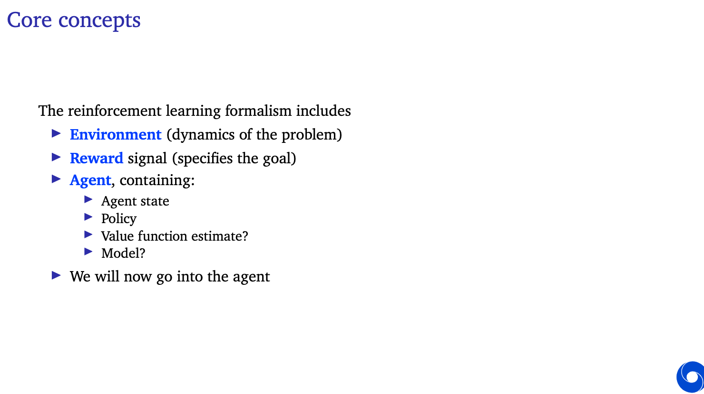
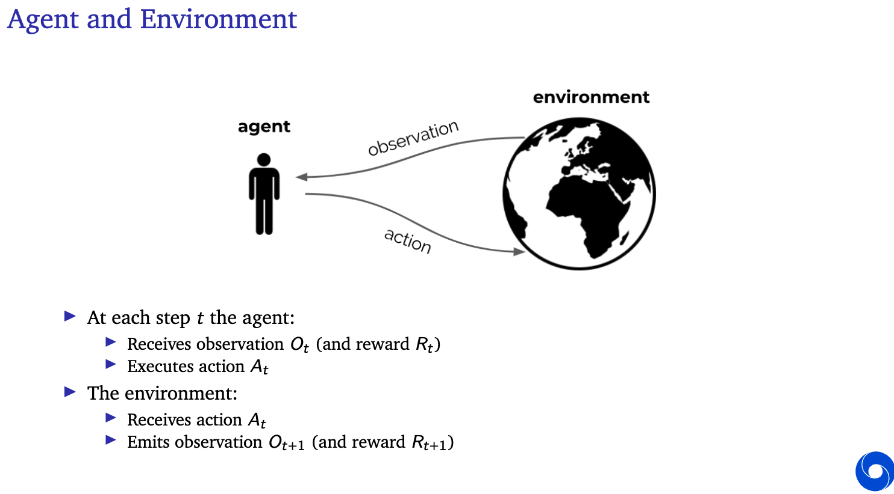
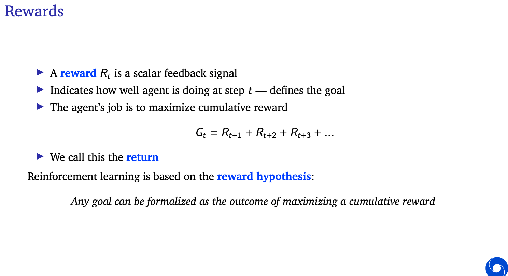
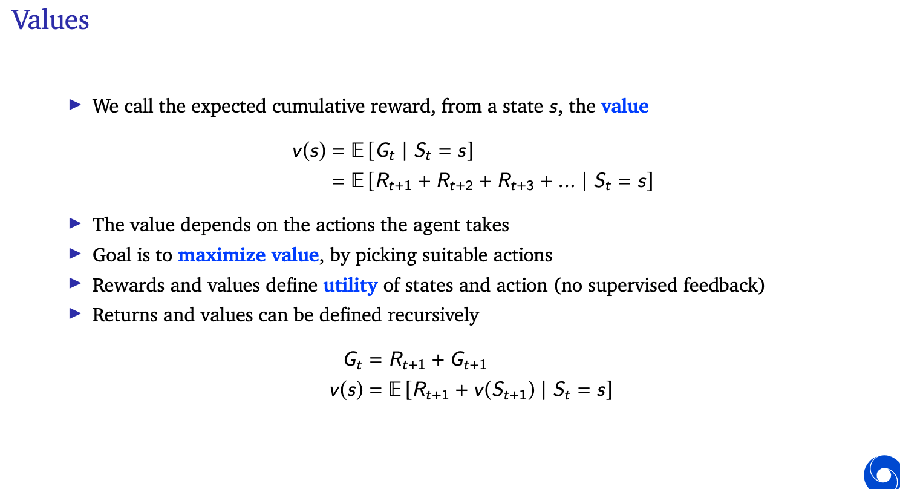
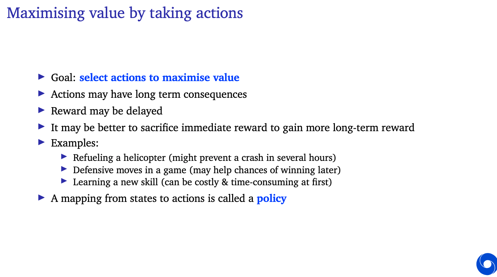

# Deep learning Q 
### Objetivies : 
1. Understand Reinforcment Learnign  
2. Understand the algorthim deep learning Q
3. Implement deep learning Q from Scratch 
4. How deep-Q related to other like policy gradient, actor critic 

## Reinforcement learning

- Agent
  
  
- reward 
  
  
- values and max values 
  
  
- Environment 
  
- Actions 
* discreate << q-learning  
* continuous 

## Markov Decision Process .. 
state depend only on previous state and actions 

value function = markov property + policy 
Bellman Equations 

agent interact with environment and have reward. 
for q-learnign for example, agent try to maximize its 
quality with every move in order to reach to the goal. 

when you use deep-q we have deep learning, to find the 
best place we are moving by backprobagete the loss function 

1. model-free vs model-based 
2. value-based vs policy-based
3. off-policy vs on-policy

## Q-learning 
how to improve the reward from the environment ? 
discrate-envromnemt 
in python you need like history
you can do this using python dictonary 

### algorthim 
* initialize Q for all states s and actions a 
* initilize aplph = 0.001, gamma = 0.9, epslion_max=1.0
epslion_min = 0.01
  * repeat for n_epsiodes 
  s = 0 
    for step of epsiode 
    select with epsilion greedy 
    perform a, get new sates s and reward r 
    q(s,a) = q(s,a)+alpha(r_gamma_max Q(s',a_max)-Q(s,a))
    s = s'

### how to code this ?? 
using class for agent (q table, )

q is dictonary 
epsilon decrease 
plot for 100 games

